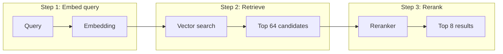

# Retriever

A retrieval demo built on LlamaIndex, with optional reranking support.

## Overview



## Basic Usage

### Makefile startup

```bash
make up                     # Build and run the API with the full dataset
make demo                   # Build and run with data/demo.csv
make start                  # Alias for make up
make dev                    # Run locally with installed Python dependencies
make health                 # Check http://127.0.0.1:18763/
```

Docker startup requires NVIDIA GPU support. Local startup requires the Python
dependencies from `Dockerfile`. Download missing models with `make models`
(requires the Hugging Face CLI). Use `PORT=8080` to change the port.

### Startup and inference

#### Option 1: Docker

```bash
# Terminal 1: Startup (from the repository root)
make build
docker run --rm --gpus all -p 18763:18763 --shm-size=4g \
  -v "$PWD/.cache:/app/.cache" retriever \
  python -m uvicorn api.main:app --host 0.0.0.0 --port 18763
```

```bash
# Terminal 2: Inference (wait for Application startup complete)
# Keep Terminal 1 running
curl --get --data-urlencode "q=what causes hiccups?" \
  http://127.0.0.1:18763/retrieve
```

#### Option 2: Local API

```bash
# Terminal 1: Startup (from the repository root)
python -m uvicorn api.main:app --port 18763 --reload
```

```bash
# Terminal 2: Inference (wait for Application startup complete)
# Keep Terminal 1 running
curl --get --data-urlencode "q=what causes hiccups?" \
  http://127.0.0.1:18763/retrieve
```

### Python usage

```python
from core.retriever import Retriever

r = Retriever(
    csv_path="data/demo.csv",
    model_name="Qwen/Qwen3-Embedding-0.6B",
    reranker_name="BAAI/bge-reranker-v2-m3",  # optional
    retrieve_k=64,
    top_k=8,
    rebuild_index=True,
)
r.load()

for node in r.search("what causes hiccups?"):
    print(node.metadata["id"], node.text, node.score)
```

## API specification

Base URL: `http://127.0.0.1:18763`

| Method | Endpoint | Request | Response |
| --- | --- | --- | --- |
| GET | `/` | — | `{"status":"ok"}` |
| GET | `/retrieve` | Required query string: `q` | Up to 8 ranked results |

Retrieval response (example):

```json
{
  "results": [
    {
      "id": "document-001",
      "text": "Document text.",
      "score": 0.95
    }
  ]
}
```

`id` may be null. Higher scores rank better; scores are not probabilities.

Status: `200` success · `422` missing `q` · `500` server error.

Docs: `/docs` · OpenAPI: `/openapi.json`.
